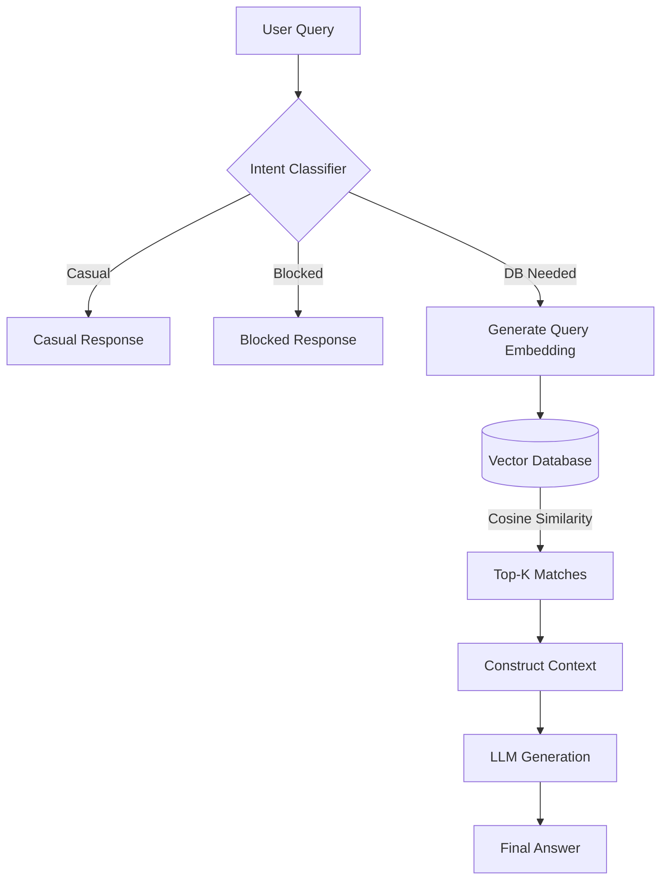

# 🤖 RAG Chatbot System (Proof of Concept)

> **Retrieval-Augmented Generation (RAG) System built with Laravel, OpenAI/OpenRouter, and Vector Embeddings.**

This project demonstrates a production-ready implementation of a context-aware AI chatbot that intelligently searches your database to answer user queries. It moves beyond simple keyword search to understand *intent* and *semantics*.

---

## 🚀 Key Features

- **🧠 Semantic Search**: Understands "who runs the company" matches "Managing Director" (Vector Embeddings).
- **⚡ Zero-Latency Updates**: Embeddings auto-sync in background via Queues when content changes.
- **🔌 One-Line Integration**: Add `use HasEmbeddings;` to ANY model to make it searchable.
- **🛡️ Secure & Whitelisted**: Strict config-based whitelist for searchable tables and columns.
- **💬 Context-Aware**: Remembers conversation history for natural follow-up questions.
- **🚫 Intent Classification**: Distinguishes between "casual chat", "database queries", and "blocked topics".

---

## 🛠️ Architecture Overview

The system uses a hybrid approach combining **Vector Search (Cosine Similarity)** and **LLM Generation**.



---

## 💡 Proof of Concept: The Code

Here are the core components that make this system work.

### 1. The "Magic" Trait (`HasEmbeddings`)

We created a reusable trait that automatically handles embedding generation. You just add it to any model, and it hooks into Eloquent events (`created`, `updated`, `deleted`).

```php
// app/Models/Article.php
use Modules\Rag\app\Traits\HasEmbeddings;

class Article extends Model
{
    use HasEmbeddings; // 👈 ONE LINE to enable AI search!
}
```

**How it works:**
1. User saves an Article.
2. Trait detects change.
3. Dispatches `GenerateModelEmbedding` job to queue (Non-blocking).
4. Job calls OpenAI API to get vector.
5. Saves vector to `data_embeddings` table.

### 2. Semantic Search Logic (`DatabaseService`)

Instead of `LIKE %query%`, we use vector math to find meaning.

```php
// Simplified logic from DatabaseService.php
public function processQuery($query)
{
    // 1. Convert user query to vector
    $queryVector = $this->embeddingService->generateEmbedding($query);
    
    // 2. Find similar vectors in database (Cosine Similarity)
    // "Managing Director" vector is close to "Boss" vector
    $matches = $this->embeddingService->findSimilar($queryVector);
    
    // 3. Fetch actual data from best matching table
    $data = DB::table($matches[0]['table'])->where('id', $matches[0]['id'])->get();
    
    // 4. Feed data to AI to generate natural answer
    return $this->ragService->generateAnswer($query, $data);
}
```

### 3. Configuration (`config/rag.php`)

Strict control over what the AI can see.

```php
'allowed_tables' => [
    'services' => [
        'description' => 'Our service offerings',
        'columns' => ['title', 'description'], // Only these columns are embedded
    ],
    'teams' => [
        'description' => 'Team members',
        'columns' => ['name', 'bio', 'email'], // Contact info included!
    ],
    // 'users' table NOT listed = NOT searchable (Security)
],
```

---

## 🧪 Real-World Examples

### Scenario A: Vague Query
**User:** "Who is the boss?"
- **Keyword Search:** 0 results (No record contains "boss").
- **Our RAG System:** Finds "Managing Director" (High semantic similarity).
- **AI Response:** "Our Managing Director is Gokul Subedi..."

### Scenario B: Contact Info
**User:** "How do I contact the visa guy?"
- **System:** Finds "Binod Thapa" (Visa Advisor) matches "visa guy".
- **AI Response:** "You can contact Binod Thapa at binod@visobotics.com..."

### Scenario C: Context
**User:** "Tell me about Python training."
**AI:** "We offer Python for Robotics..."
**User:** "How much is it?" (No context provided)
**System:** Uses conversation history to know "it" refers to "Python training".
**AI:** "The Python for Robotics course costs Rs. 25,000."

---

## 📦 Database Structure

We use a single polymorphic table for all embeddings, keeping the schema clean.

| id | table_name | entity_id | embedding (JSON Vector) | raw_text |
|----|------------|-----------|-------------------------|----------|
| 1  | services   | 5         | [0.012, -0.23, ...]     | "Industrial Automation..." |
| 2  | teams      | 1         | [0.88, 0.12, ...]       | "Gokul Subedi Managing..." |

---

## 🚀 How to Replicate

1. **Install Dependencies**: Laravel, OpenAI PHP client.
2. **Create Embeddings Table**: Migration for storing vectors.
3. **Create Service**: Handle API calls to OpenRouter/OpenAI.
4. **Create Trait**: Hook into model events.
5. **Implement RAG Logic**: Retrieve -> Rank -> Generate.

---

> **Note:** This is a showcase of the RAG module implementation. The full system includes a complete CMS, Role Management, and Dashboard as seen in the main repository.
